## 第一个完整的汇编程序

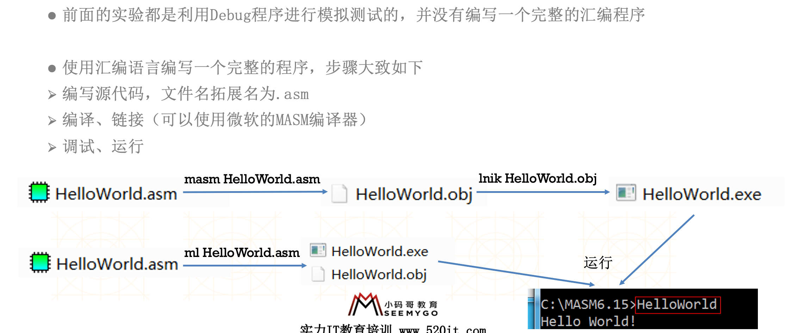

### 汇编语言的组成

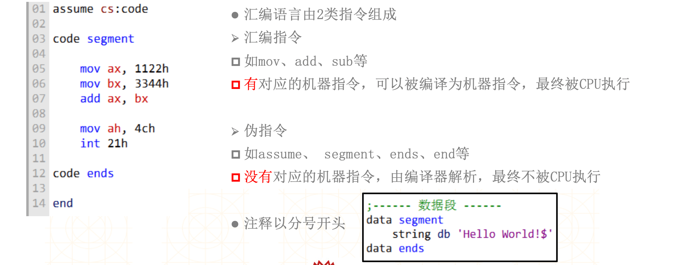

### 源程序 -> 可执行

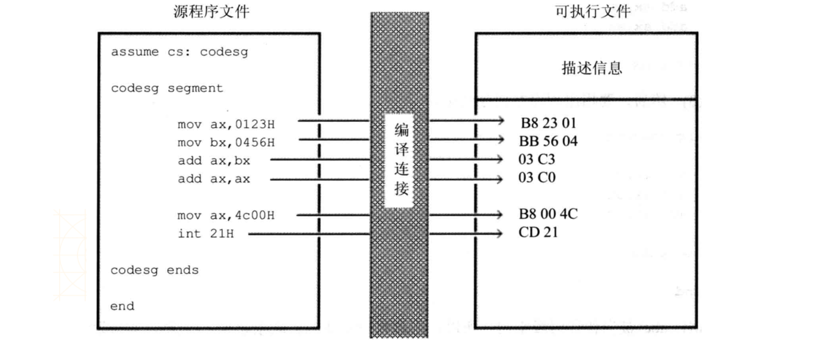

### 调试可执行程序

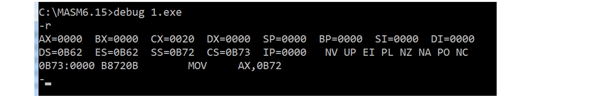

### 伪指令 – segment、ends、end

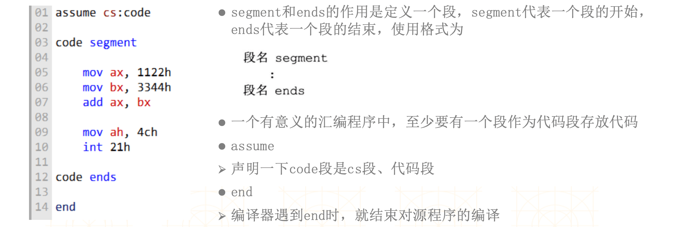

### 退出程序

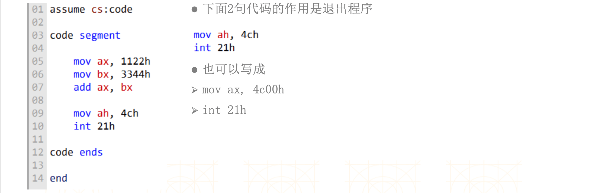

## 包含多个段的程序

### 在代码段中存放数据

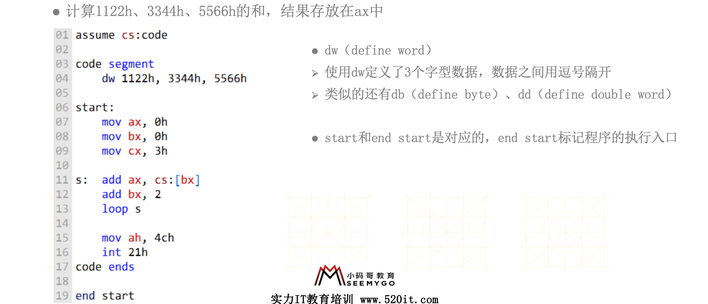

### 在代码段中使用栈

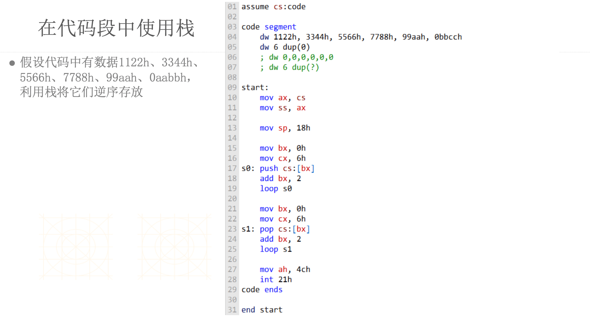

### 包含多个段的程序

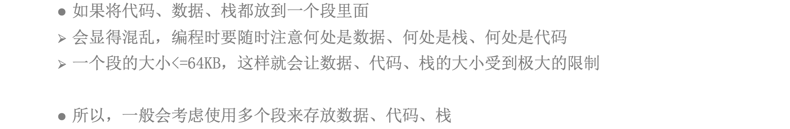

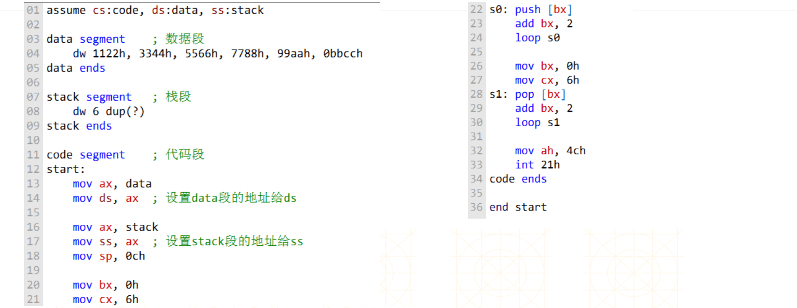

### 给数据起标号

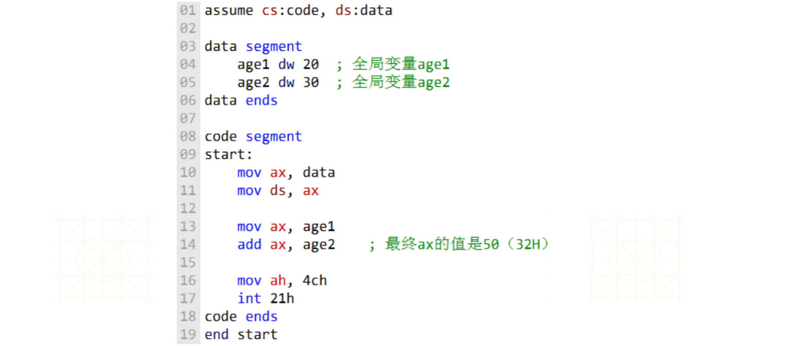

### 打印Hello World

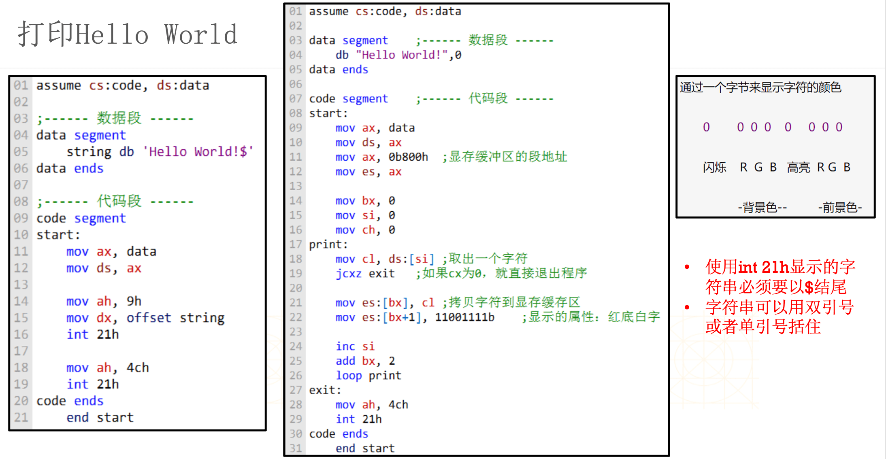

- 代码段 + 数据段

```assembly
;提醒开发者每个段的含义
assume cs:code, ds:data
 
  
; ----- 数据段 begin ----- 
data segment            
    age db 20h
    no dw 30h 
    db 10 dup(6) ; 生成10个连续的6 
    string db 'Hello World!$'  
data ends  
; ----- 数据段 end ----- 


; ----- 代码段 begin ----- 
code segment  
start:     
    ; 手动设置ds的值
    mov ax, data
    mov ds, ax
    
    mov ax, no
    mov bl, age

    ; 打印的编号9h放在ah中，打印的起始地址放在dx中，调用中断int 21h开始打印
    ; offset string代表string的偏移地址  
    mov dx, offset string 
 
    mov ah, 9h
    int 21h 
    
    ; 退出
    mov ax, 4c00h
    int 21h    
code ends
; ----- 代码段 end -----    
   
   
; 编译结束，start是程序入口
; start所在的段就是代码段
; 所以cs的值就是code段的段地址
; 相当于cs的值已经自动设置完毕
end start
```

- 代码段 + 数据段 + 栈段

```assembly
assume cs:code, ds:data, ss:stack

; 栈段
stack segment   
    db 10 dup(8)
stack ends 

; 数据段
data segment   
    db 20 dup(9)
data ends 

; 代码段
code segment
start: 
    ; 手动设置ss和ds
    mov ax, stack
    mov ss, ax   
    mov ax, data
    mov ds, ax

    mov ax, 1122h
    mov bx, 3344h  
    
    mov [0], ax
    
    ; 使用栈
    mov sp, 10 
    push ax
    push bx
    pop ax
    pop bx
    
    
    ; 退出
    mov ax, 4c00h
    int 21h   
code ends

end start
```


## call和ret

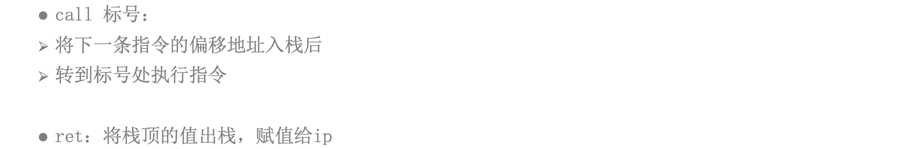

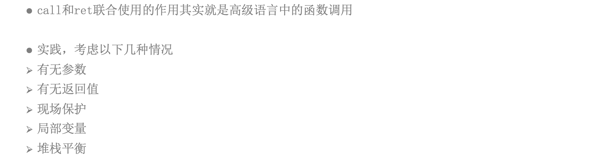

- call 和 ret

```assembly
assume cs:code, ds:data, ss:stack

; 栈段
stack segment
    db 100 dup(0)
stack ends  

; 数据段
data segment 
    db 100 dup(0) 
    string db 'Hello!$'
data ends

; 代码段
code segment
start:
    ; 手动设置ds、ss的值
    mov ax, data
    mov ds, ax
    mov ax, stack
    mov ss, ax  
    
    ; 业务逻辑 
    call print
    
    mov ax, 1122h
    mov bx, 3344h
    add ax, bx  
    
    ; 退出
    mov ax, 4c00h
    int 21h 
    
; 打印字符串    
print:    

    ; ds:dx告知字符串地址    
    mov dx, offset string
    mov ah, 9h
    int 21h
    
    ret 
                
code ends  

end start 

; 函数的要素
; 1.参数
; 2.返回值
; 3.局部变量
```

- 函数的返回值

```assembly
assume cs:code, ds:data, ss:stack

; 栈段
stack segment
    db 100 dup(0)
stack ends  


; 数据段
data segment  
    a dw 0
    db 100 dup(0) 
    string db 'Hello!$'
data ends


; 代码段
code segment
start:
    ; 手动设置ds、ss的值
    mov ax, data
    mov ds, ax
    mov ax, stack
    mov ss, ax  
    
    ; 业务逻辑 
    call mathFunc3
    
    mov bx, ax  
    
    ; 退出
    mov ax, 4c00h
    int 21h 
    
; 返回2的3次方
; 返回值放到ax寄存器中     
mathFunc3:  
    mov ax, 2
    add ax, ax
    add ax, ax 
    
    ret 

; 返回2的3次方
; 返回值放到a中     
mathFunc2:  
    mov ax, 2
    add ax, ax
    add ax, ax 
    
    mov a, ax
    
    ret  
    
; 返回2的3次方
; 返回值放到ds:0中     
mathFunc1:  
    mov ax, 2
    add ax, ax
    add ax, ax 
    
    mov [0], ax
    
    ret 
                
code ends  

end start
```

- 函数的参数

```assembly
assume cs:code, ds:data, ss:stack

; 栈段
stack segment
    db 100 dup(0)
stack ends  


; 数据段
data segment  
    db 100 dup(0) 
data ends


; 代码段
code segment
start:
    ; 手动设置ds、ss的值
    mov ax, data
    mov ds, ax
    mov ax, stack
    mov ss, ax  
    
    ; 业务逻辑
    push 1122h
    push 3344h 
    call sum3 
    add sp, 4
    
    push 2222h
    push 2222h 
    call sum3
    add sp, 4
    
    push 3333h
    push 3333h 
    call sum3
    add sp, 4
     
    mov cx, 1122h 
    mov dx, 2233h 
    call sum1 
    
    mov word ptr [0], 1122h 
    mov word ptr [2], 2233h 
    call sum2  
    
    ; 退出
    mov ax, 4c00h
    int 21h 
    
; 返回值放ax寄存器
; 传递2个参数(放入栈中)    
sum3:   
    ; 访问栈中的参数
    mov bp, sp
    mov ax, ss:[bp+2]
    add ax, ss:[bp+4]
    ret 
          
; 返回值放ax寄存器
; 传递2个参数(分别放ds:0、ds:2)    
sum2:         
    mov ax, [0]
    add ax, [2]
    ret 
            
; 返回值放ax寄存器
; 传递2个参数（分别放cx、dx中）    
sum1:  
    mov ax, cx
    add ax, dx
    ret 
                
code ends  

end start

; 栈平衡：函数调用前后的栈顶指针要一致
; 栈如果不平衡的结果：栈空间迟早会被用完
```

- 递归调用

```assembly
assume cs:code, ds:data, ss:stack

; 栈段
stack segment
    db 100 dup(0)
stack ends  


; 数据段
data segment  
    db 100 dup(0) 
data ends


; 代码段
code segment
start:
    ; 手动设置ds、ss的值
    mov ax, data
    mov ds, ax
    mov ax, stack
    mov ss, ax  
    
    ; 业务逻辑
    push 1122h
    push 3344h 
    call sum
    add sp, 4  
    
    push 1122h
    push 3344h  
    call minus   
    
    ; 退出
    mov ax, 4c00h
    int 21h 
    
; 返回值放ax寄存器
; 传递2个参数(放入栈中)    
sum:   
    ; 访问栈中的参数
    mov bp, sp
    mov ax, ss:[bp+2]
    add ax, ss:[bp+4]
    
    ret 
        
; 返回值放ax寄存器
; 传递2个参数(放入栈中)   
minus:
    mov bp, sp 
    mov ax, ss:[bp+2]
    sub ax, ss:[bp+4]
     
    ret 4
    
    
                
code ends  

end start

; 栈平衡：函数调用前后的栈顶指针要一致
; 栈如果不平衡的结果：栈空间迟早会被用完

; 栈平衡的方法
; 1.外平栈
;    push 1122h
;    push 3344h 
;    call sum
;    add sp, 4 
; 2.内平栈
;    ret 4
```

- 调用约定

```assembly
;对c/c++ 函数/方法有效
;int __cdecl sum(int a, int b) ;__cdecl，外平栈，参数从右至左入栈
;int __stdcall sum(int a, int b) ;__stdcall，内平栈，参数从右至左入栈
;int __fastcall sum(int a, int b) ;__fastcall，内平栈，ecx,edx分别传递前两个参数，其他参数从右至左入栈

; 函数调用的本质
; 1.参数：push 参数值
; 2.返回值：返回值存放到ax中
; 3.栈平衡
```

- 函数的局部变量

```assembly
assume cs:code, ds:data, ss:stack

; 栈段
stack segment
    db 100 dup(0)
stack ends  

; 数据段
data segment  
    db 100 dup(0) 
data ends

; 代码段
code segment
start:
    ; 手动设置ds、ss的值
    mov ax, data
    mov ds, ax
    mov ax, stack
    mov ss, ax  
    
    ; 业务逻辑
    push 1
    push 2 
    call sum 
    add sp, 4 
     
    push 1
    push 2 
    call sum 
    add sp, 4   
    
    ; 退出
    mov ax, 4c00h
    int 21h 
    
; 返回值放ax寄存器
; 传递2个参数(放入栈中)    
sum:
    ; 保护bp    
    push bp
    ; 保存sp之前的值：指向bp以前的值
    mov bp, sp
    ; 预留10个字节的空间给局部变量 
    sub sp, 10  
    
    ; -------- 业务逻辑 - begin
    ; 定义2个局部变量
    mov word ptr ss:[bp-2], 3 
    mov word ptr ss:[bp-4], 4 
    mov ax, ss:[bp-2]
    add ax, ss:[bp-4]
    mov ss:[bp-6], ax
    
    ; 访问栈中的参数
    mov ax, ss:[bp+4]
    add ax, ss:[bp+6] 
    add ax, ss:[bp-6] 
    ; -------- 业务逻辑 - end
                       
    ; 恢复sp
    mov sp, bp
    ; 恢复bp
    pop bp
    
    ret 
                
code ends  

end start

; 函数的调用流程（内存）
; 1.push 参数
; 2.push 函数的返回地址
; 3.push bp （保留bp之前的值，方便以后恢复）
; 4.mov bp, sp （保留sp之前的值，方便以后恢复）
; 5.sub sp,空间大小 （分配空间给局部变量）
; 6.执行业务逻辑
; 7.mov sp, bp （恢复sp之前的值）
; 8.pop bp （恢复bp之前的值）
; 9.ret （将函数的返回地址出栈，执行下一条指令）
; 10.恢复栈平衡 （add sp,参数所占的空间）
```

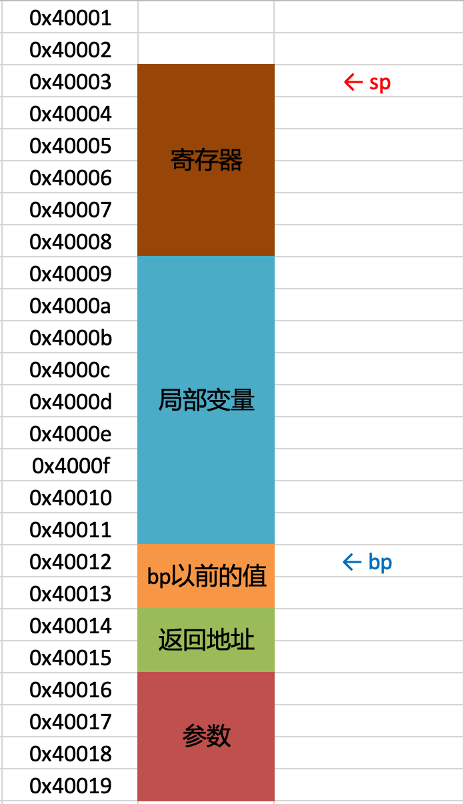

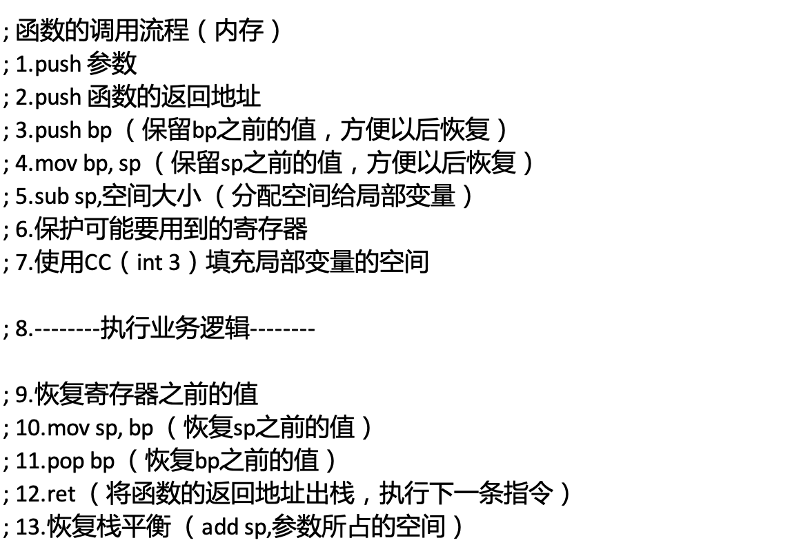

- 函数的完整流程

```assembly
assume cs:code, ds:data, ss:stack

; 栈段
stack segment
    db 100 dup(0)
stack ends  

; 数据段
data segment  
    db 100 dup(0) 
data ends

; 代码段
code segment
start:
    ; 手动设置ds、ss的值
    mov ax, data
    mov ds, ax
    mov ax, stack
    mov ss, ax 
    
    mov si, 1
    mov di, 2
    mov bx, 3 
    mov bp, 4
    
    ; 业务逻辑
    push 1
    push 2 
    call sum 
    add sp, 4 
    
    ; 退出
    mov ax, 4c00h
    int 21h 
    
; 返回值放ax寄存器
; 传递2个参数(放入栈中)    
sum:
    ; 保护bp    
    push bp
    ; 保存sp之前的值：指向bp以前的值
    mov bp, sp
    ; 预留10个字节的空间给局部变量 
    sub sp, 10
    
    ; 保护可能会用到的寄存器
    push si
    push di
    push bx 
    
    ; 给局部变量空间填充int 3（CCCC）
    ; stosw的作用：将ax的值拷贝到es:di中,同时di的值会+2
    mov ax, 0cccch
    ; 让es等于ss
    mov bx, ss
    mov es, bx 
    ; 让di等于bp-10（局部变量地址最小的区域）
    mov di, bp
    sub di, 10   
    ; cx决定了stosw的执行次数
    mov cx, 5  
    rep stosw  
    ; rep的作用：重复执行某个指令（执行次数由cx决定）
     
    ; -------- 业务逻辑 - begin
    ; 定义2个局部变量
    mov word ptr ss:[bp-2], 3 
    mov word ptr ss:[bp-4], 4 
    mov ax, ss:[bp-2]
    add ax, ss:[bp-4]
    mov ss:[bp-6], ax 
    
    ; 访问栈中的参数
    mov ax, ss:[bp+4]
    add ax, ss:[bp+6] 
    add ax, ss:[bp-6]   
    ; -------- 业务逻辑 - end 
    
    ; 恢复寄存器的值
    pop bx
    pop di
    pop si
                       
    ; 恢复sp
    mov sp, bp
    ; 恢复bp
    pop bp
    
    ret 
                
code ends  

end start

; 函数的调用流程（内存）
; 1.push 参数
; 2.push 函数的返回地址
; 3.push bp （保留bp之前的值，方便以后恢复）
; 4.mov bp, sp （保留sp之前的值，方便以后恢复）
; 5.sub sp,空间大小 （分配空间给局部变量）
; 6.保护可能要用到的寄存器
; 7.使用CC（int 3）填充局部变量的空间  

; 8.--------执行业务逻辑--------      

; 9.恢复寄存器之前的值
; 10.mov sp, bp （恢复sp之前的值）
; 11.pop bp （恢复bp之前的值）
; 12.ret （将函数的返回地址出栈，执行下一条指令）
; 13.恢复栈平衡 （add sp,参数所占的空间）
```

## 栈帧

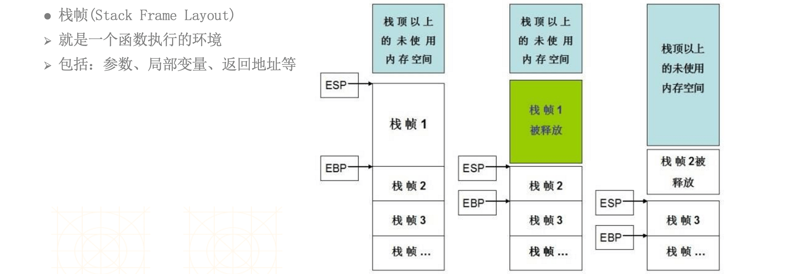


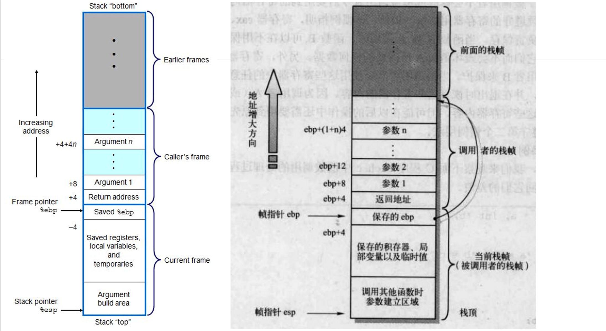