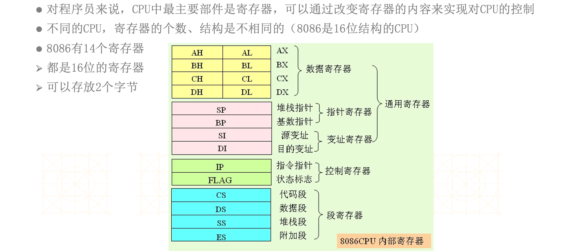
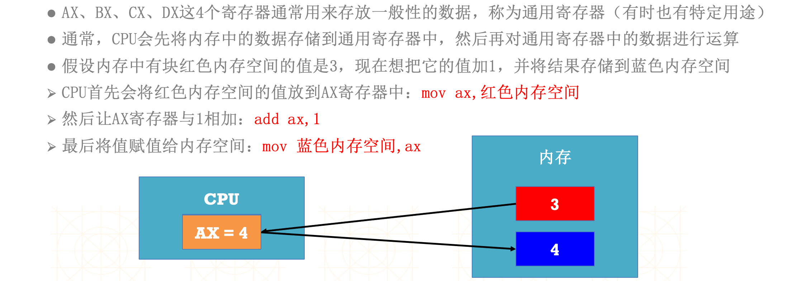
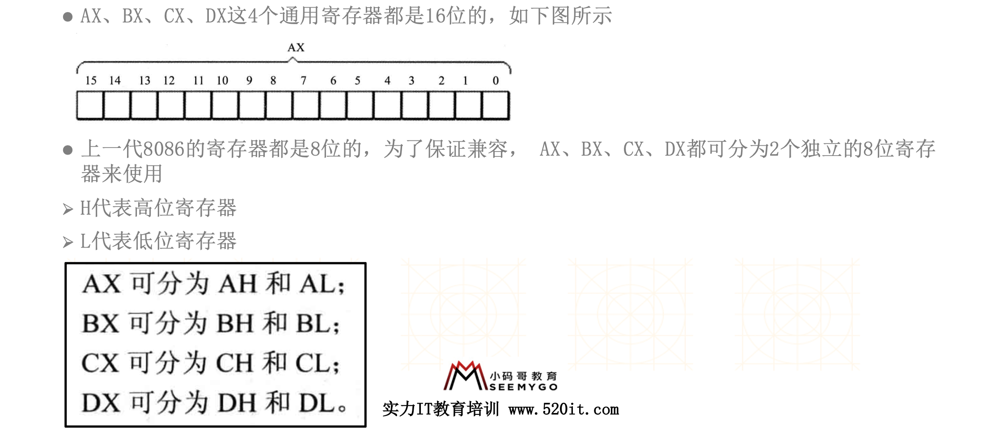
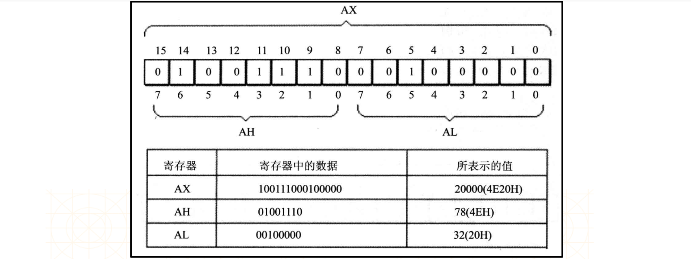
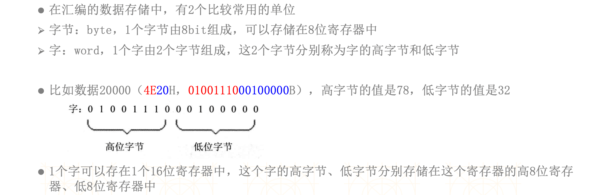
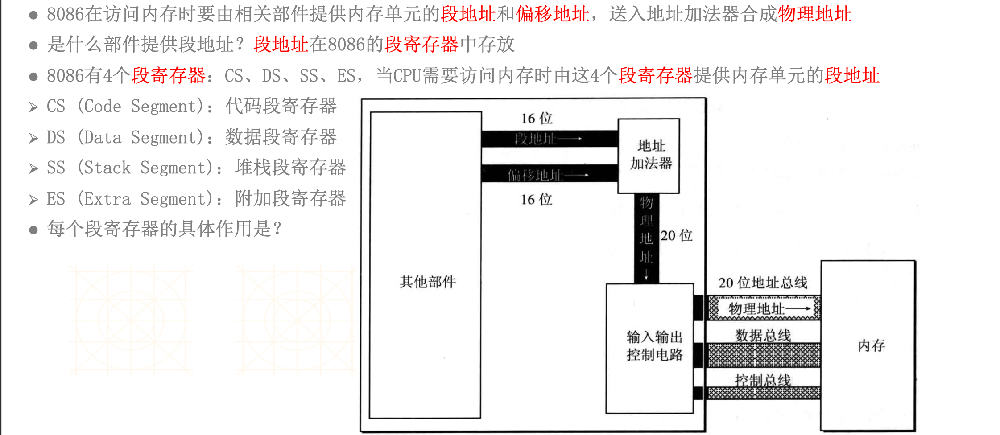
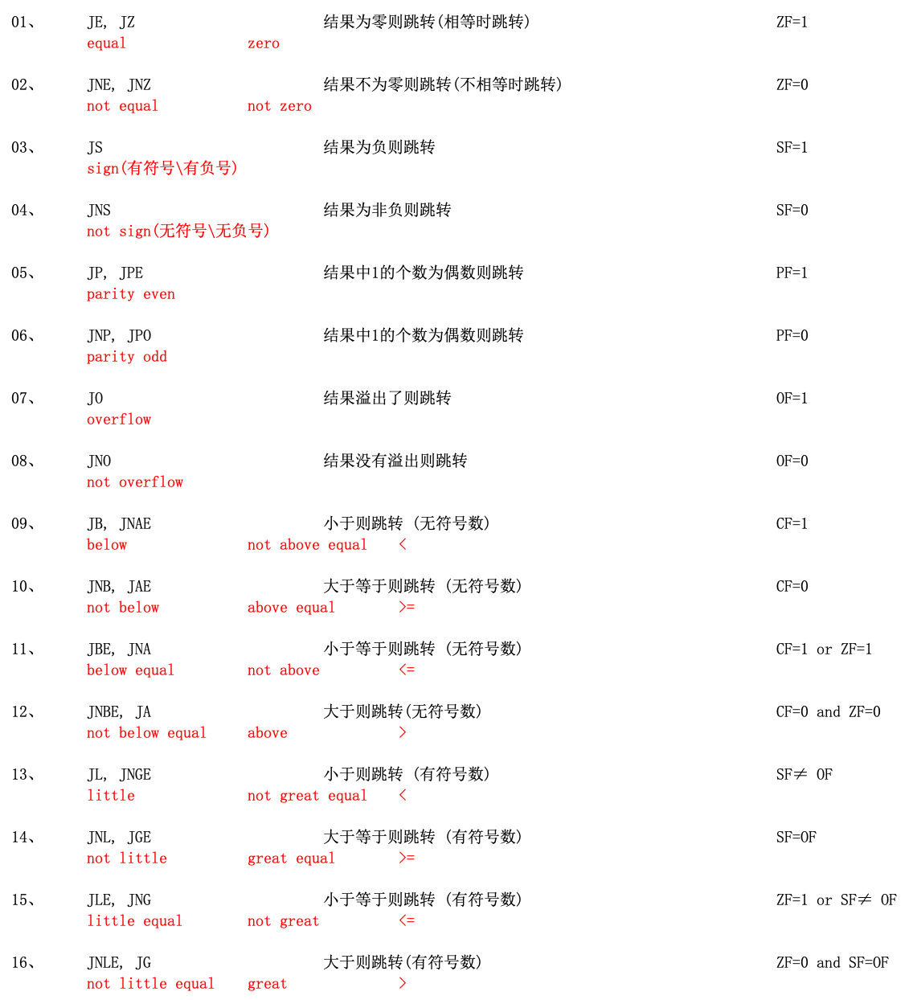

## CPU的典型构成




## 通用寄存器







## 字节与字



## 段寄存器



## 标志寄存器

### JCC指令



```assembly
assume cs:code, ds:data, ss:stack

; 栈段
stack segment
    db 100 dup(0)
stack ends  

; 数据段
data segment  
    db 100 dup(0) 
data ends

; 代码段
code segment
start:
    ; 手动设置ds、ss的值
    mov ax, data
    mov ds, ax
    mov ax, stack
    mov ss, ax 
    
    
    mov ax, 11
    mov bx, 11
    sub ax, bx
    
    ; 退出
    mov ax, 4c00h
    int 21h 
                
code ends  

end start
```

