## AT&T汇编 vs Intel汇编

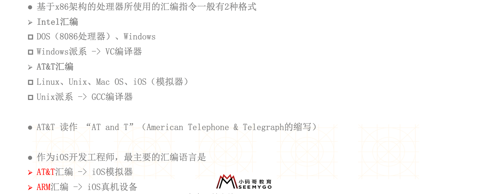

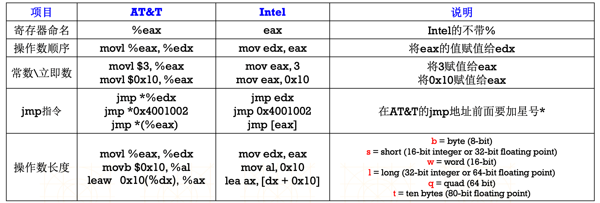

### 寻址方式

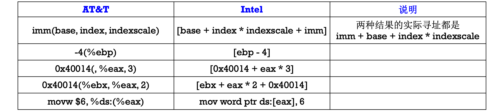

## 64位AT&T汇编的寄存器

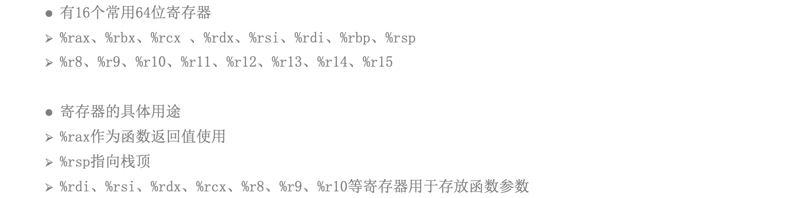

- 超过7个之后用堆存放，具体看xcode生成的汇编

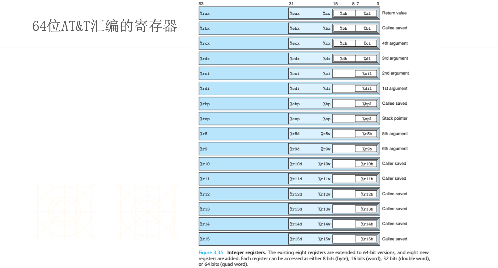

### 栈帧

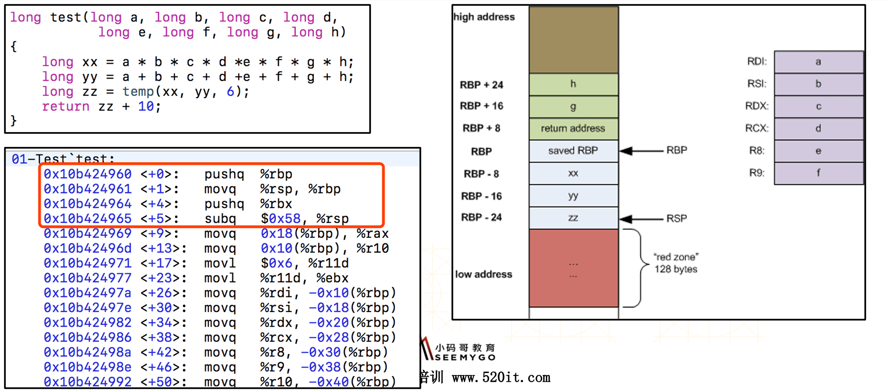

由rsp指向位置以外128字节的区域被视为保留的，不应该被信号或中断处理句柄改写。因此，函数可以将这个区域用于无需跨越函数调用的临时数据。特别的，叶子函数可以将这个区域用作它们整个栈帧，而不是在prologue与epilogue中调整栈指针。这个区域称为红区。

简单地说，红区是一个优化。代码可以假定rsp以下128个字节不会被信号或中断处理句柄破坏，因此可以用于临时数据，无需显式地移动栈指针。最后一句是这个优化所在——递减rsp并保存它是在对数据使用红区时，可以被节省的两条指令。

不过，记住红区将被函数调用破坏，因此它通常在叶子函数（不调用其他函数的函数）中最有用

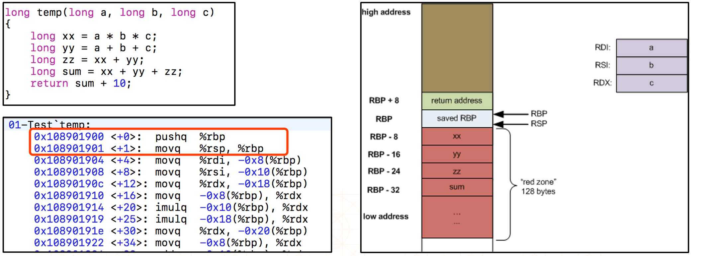

因为temp函数仅有3个实参，调用它不要求栈使用，因为所有的实参都适用寄存器。另外，因为它是一个叶子函数，gcc选择对其所有局部变量使用红区。这样，无需减少rsp（随后恢复）来为这些数据分配空间

## 常见代码反汇编

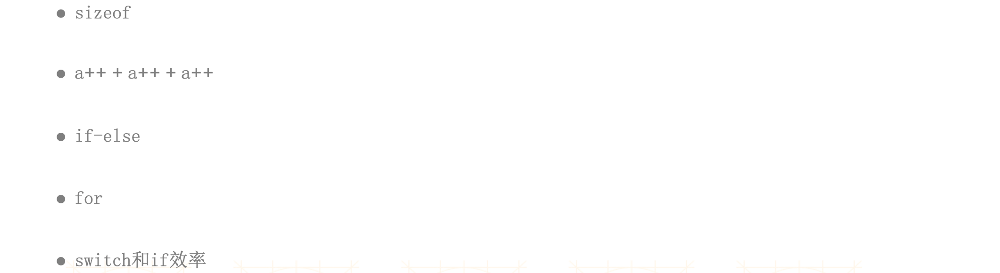

## 编译器的优化

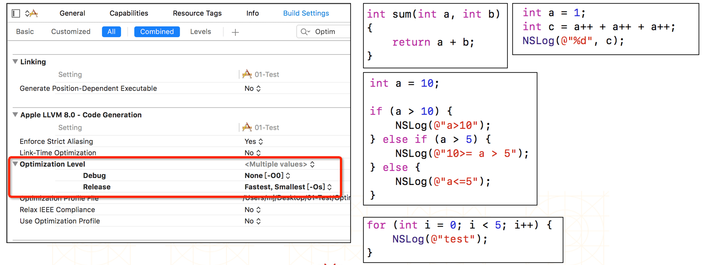

## 外联汇编

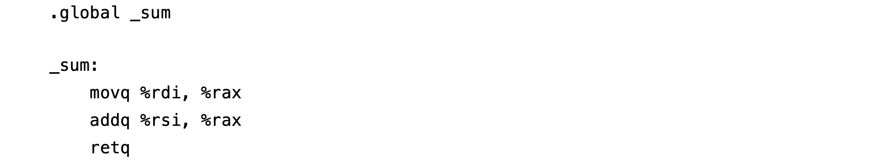

## 内联汇编

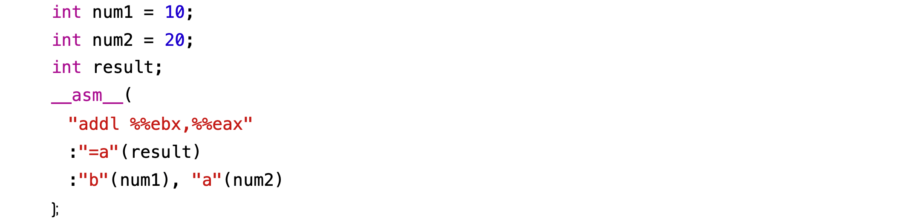

## lldb常用指令

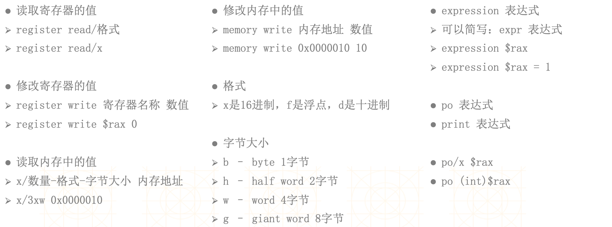